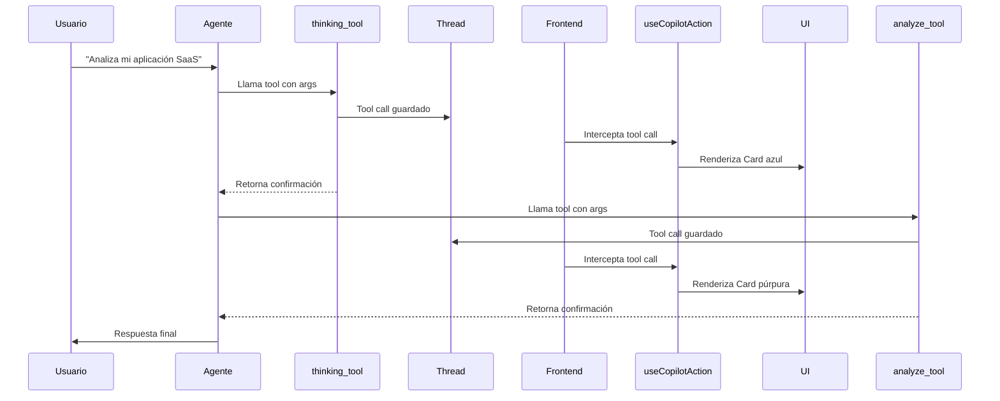

# 🎯 Reasoning con Tool Calls (Solución Oficial)

## 📋 Descripción

Esta es **la forma correcta y oficial** de implementar reasoning con CopilotKit. Los tool calls se renderizan automáticamente en el chat y **quedan respaldados en el thread**.

## ✅ Ventajas

- ✅ **Oficial**: Método recomendado por CopilotKit
- ✅ **Respaldado en el thread**: Los tool calls quedan en el historial automáticamente
- ✅ **Renderizado automático**: Usa `useCopilotAction` con `render`
- ✅ **Estados en tiempo real**: `inProgress`, `executing`, `complete`
- ✅ **Acceso a argumentos**: Puedes acceder a todos los args del tool call
- ✅ **No requiere middleware**: Todo se maneja en el frontend

## 🔨 Implementación

### 1. Backend (Python) - Tools Normales

Tus tools ya están correctas. Solo asegúrate de que sean tools normales de LangChain:

```python
from langchain.tools import tool
from typing import Optional

@tool
def thinking_tool(
    title: str,
    thought: str,
    action: Optional[str] = None,
    confidence: float = 0.8,
) -> str:
    """
    Permite al agente pensar en voz alta sobre el problema.
    
    Args:
        title: Título corto del pensamiento
        thought: El pensamiento completo del agente
        action: Siguiente acción que planea tomar (opcional)
        confidence: Nivel de confianza (0-1)
    
    Returns:
        Confirmación del pensamiento
    """
    return f"Pensamiento registrado: {title}"


@tool
def analyze_tool(
    title: str,
    result: str,
    analysis: str,
    next_action: str = "continue",
    confidence: float = 0.8
) -> str:
    """
    Permite al agente analizar resultados obtenidos.
    
    Args:
        title: Título del análisis
        result: Resultado que está analizando
        analysis: El análisis detallado
        next_action: Qué hacer después
        confidence: Nivel de confianza (0-1)
    
    Returns:
        Confirmación del análisis
    """
    return f"Análisis completado: {title}"
```

### 2. Agregar las tools a tu agente

```python
from langgraph.prebuilt import create_react_agent
from langchain_openai import ChatOpenAI

model = ChatOpenAI(model="gpt-4")

# Agregar las tools al agente
agent = create_react_agent(
    model=model,
    tools=[thinking_tool, analyze_tool],  # ← Aquí agregas tus tools
    state_schema=YourAgentState,
)
```

### 3. System Prompt para el Agente

Instruye al agente sobre cuándo usar las tools:

```python
system_prompt = """
Eres un asistente útil que puede pensar en voz alta y analizar información.

Tienes acceso a dos herramientas especiales:

1. **thinking_tool**: Úsala cuando necesites:
   - Descomponer problemas complejos
   - Planear tu estrategia antes de actuar
   - Reflexionar sobre lo que has aprendido
   - Evaluar diferentes enfoques
   
   Ejemplo: Si el usuario pregunta algo complejo, PRIMERO usa thinking_tool 
   para planear tu enfoque.

2. **analyze_tool**: Úsala cuando necesites:
   - Interpretar datos obtenidos
   - Extraer conclusiones de resultados
   - Identificar patrones en información
   - Decidir próximos pasos basándote en resultados
   
   Ejemplo: Después de obtener datos (búsqueda, cálculos, etc.), 
   usa analyze_tool para interpretarlos.

**IMPORTANTE**: 
- Estas herramientas son VISIBLES para el usuario en el chat
- Úsalas para comunicar tu proceso de razonamiento
- Sé específico y claro en tus pensamientos y análisis
"""
```

### 4. Frontend (React) - Ya está implementado

El hook `useReasoningToolRenderer` ya está integrado en tu `Chat.tsx`:

```typescript
import { useReasoningToolRenderer } from '@/components/reasoning/ReasoningToolRenderer';

export function Chat() {
    // ... otros hooks ...
    
    // Hook para renderizar tool calls de reasoning
    useReasoningToolRenderer();
    
    // ... resto del componente ...
}
```

## 🎨 Personalización

### Cambiar los estilos

Edita `components/reasoning/ReasoningToolRenderer.tsx`:

```typescript
// Para pensamientos (thinking_tool)
<Card className="border-l-4 border-l-blue-500 bg-blue-50 dark:bg-blue-950 my-2">
    {/* Cambia los colores aquí */}
</Card>

// Para análisis (analyze_tool)
<Card className="border-l-4 border-l-purple-500 bg-purple-50 dark:bg-purple-950 my-2">
    {/* Cambia los colores aquí */}
</Card>
```

### Agregar más información

Puedes mostrar cualquier argumento del tool call:

```typescript
render: ({ status, args, result }) => {
    return (
        <Card>
            <CardContent>
                <p>{args.title}</p>
                <p>{args.thought}</p>
                
                {/* Mostrar resultado si está completo */}
                {status === "complete" && result && (
                    <p>Resultado: {result}</p>
                )}
            </CardContent>
        </Card>
    );
}
```

### Estados disponibles

```typescript
render: ({ status, args, result }) => {
    // status puede ser:
    // - "inProgress": Argumentos están llegando en streaming
    // - "executing": La tool está ejecutándose
    // - "complete": La tool terminó de ejecutarse
    
    if (status === "inProgress") {
        return <div>Recibiendo argumentos...</div>;
    }
    
    if (status === "executing") {
        return <div>Ejecutando tool...</div>;
    }
    
    if (status === "complete") {
        return <div>Completado! Resultado: {result}</div>;
    }
}
```

## 🔄 Flujo Completo



## 📦 Archivos del Proyecto

```
testing-copilotkit/
├── components/
│   └── reasoning/
│       └── ReasoningToolRenderer.tsx    ← Hook de renderizado
├── components/testing/
│   └── Chat.tsx                         ← Usa el hook
└── REASONING_CON_TOOL_CALLS.md         ← Esta documentación
```

## 🐛 Debugging

### Los tool calls no se renderizan

1. **Verifica que los nombres coincidan**:
```typescript
// Frontend
useCopilotAction({ name: "thinking_tool" })

// Backend
@tool
def thinking_tool(...):  # ← Debe ser exactamente igual
```

2. **Verifica que available esté en "disabled"**:
```typescript
useCopilotAction({
    name: "thinking_tool",
    available: "disabled",  // ← Importante!
    render: ...
})
```

3. **Verifica en la consola**:
```typescript
// En Chat.tsx ya tienes este debug:
useEffect(() => {
    messages.forEach((msg) => {
        console.log("Tool Calls:", msg.toolCalls);
    });
}, [messages]);
```

### El agente no llama las tools

1. **Verifica el system prompt**: Debe instruir claramente cuándo usar cada tool

2. **Verifica que las tools estén en el agente**:
```python
agent = create_react_agent(
    model=model,
    tools=[thinking_tool, analyze_tool],  # ← Aquí deben estar
)
```

3. **Prueba manualmente**: Pregunta directamente "usa thinking_tool para pensar"

## 💡 Ejemplos de Uso

### Ejemplo 1: Problema complejo

**Usuario**: "¿Cómo puedo optimizar los costos de mi infraestructura AWS?"

**Agente**:
1. Llama `thinking_tool`:
   ```
   🧠 Descomponiendo el problema
   
   Necesito identificar los servicios más costosos primero.
   Luego analizar alternativas de optimización.
   
   Siguiente acción: Solicitar lista de servicios
   Confianza: 90%
   ```

2. (Realiza búsqueda/consulta)

3. Llama `analyze_tool`:
   ```
   💡 Análisis de costos
   
   Resultado: EC2: $2,000/mes, S3: $500/mes
   
   Análisis: EC2 representa el 80% del costo. 
   Instancias están sobredimensionadas.
   
   Siguiente: Proponer rightsizing
   Confianza: 85%
   ```

4. Responde al usuario con recomendaciones

### Ejemplo 2: Análisis de datos

**Usuario**: "Analiza estos datos de ventas: [datos]"

**Agente**:
1. Llama `thinking_tool` para planear el análisis
2. Procesa los datos
3. Llama `analyze_tool` con los hallazgos
4. Responde con conclusiones

## 🆚 Comparación con otras opciones

| Característica | Tool Calls | Estado del Agente | Mensajes Formateados |
|----------------|------------|-------------------|---------------------|
| **Oficial** | ✅ Sí | ✅ Sí | ❌ No |
| **En el thread** | ✅ Sí | ⚠️ Parcial | ❌ No |
| **Datos estructurados** | ✅ Sí | ✅ Sí | ❌ No |
| **Fácil de implementar** | ✅ Sí | ⚠️ Media | ✅ Sí |
| **Estados en tiempo real** | ✅ Sí | ⚠️ Solo cambios | ❌ No |
| **Acceso a argumentos** | ✅ Sí | ✅ Sí | ❌ No |
| **Requiere middleware** | ❌ No | ❌ No | ❌ No |

## 🎯 Recomendación Final

**Usa Tool Calls** (esta solución) porque:
- ✅ Es la forma oficial de CopilotKit
- ✅ Los tool calls quedan respaldados en el thread
- ✅ Tienes acceso a estados en tiempo real
- ✅ No requiere middleware complejo
- ✅ Fácil de mantener y debugear

## 📚 Referencias

- [CopilotKit - Tool-based Generative UI](https://docs.copilotkit.ai/langgraph/generative-ui/tool-based)
- [useCopilotAction Reference](https://docs.copilotkit.ai/reference/hooks/useCopilotAction)
- [LangChain Tools](https://python.langchain.com/docs/modules/agents/tools/)
